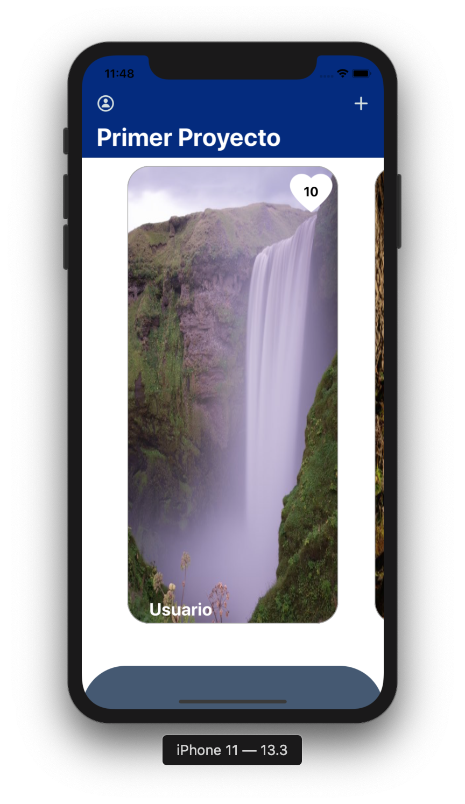
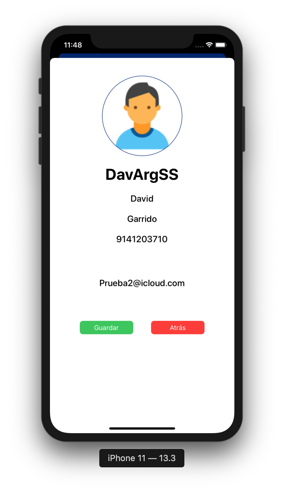
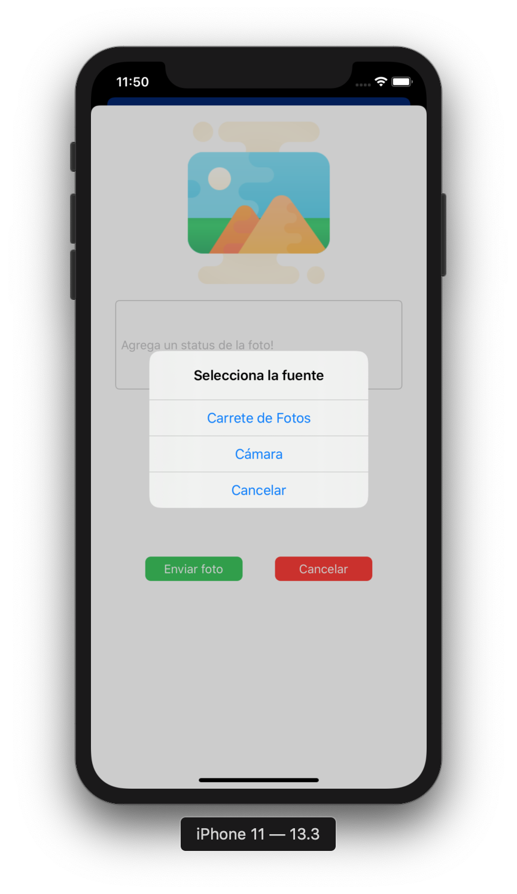
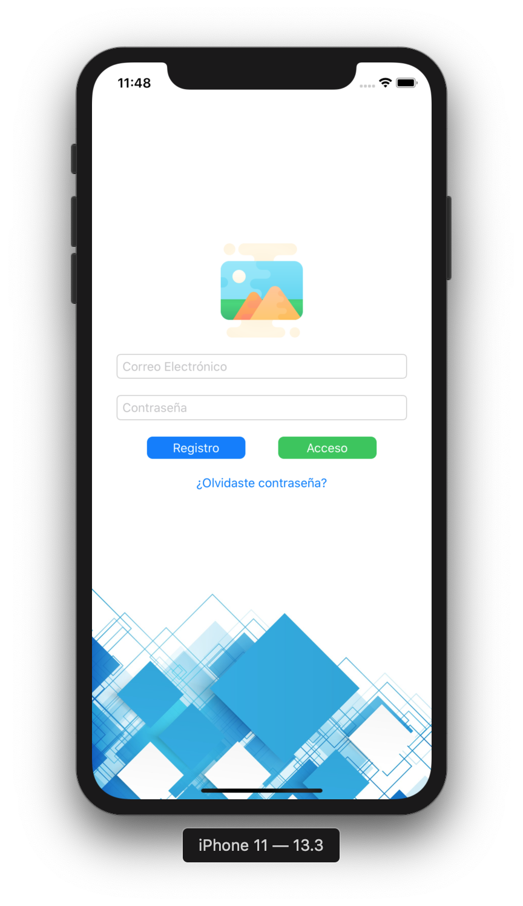
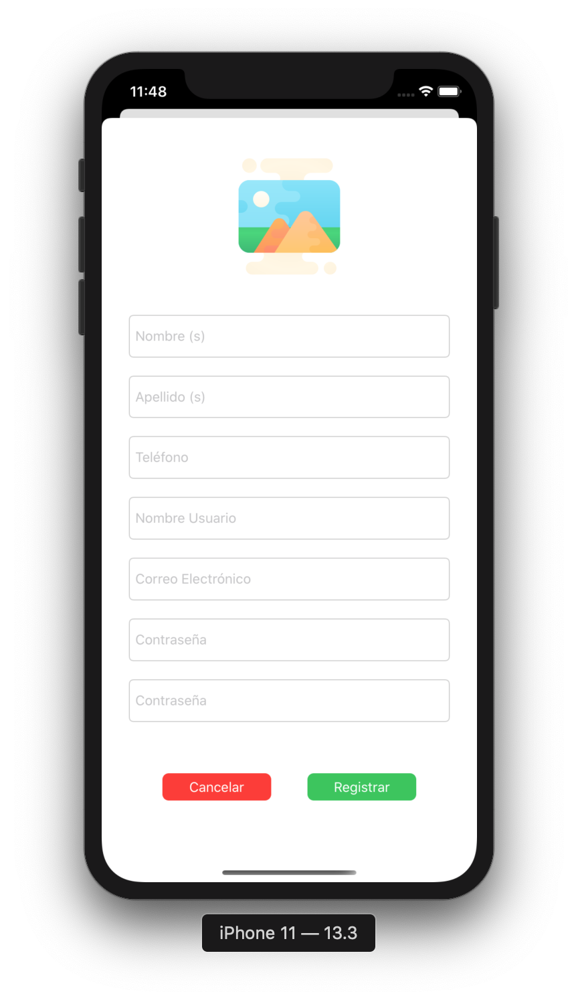
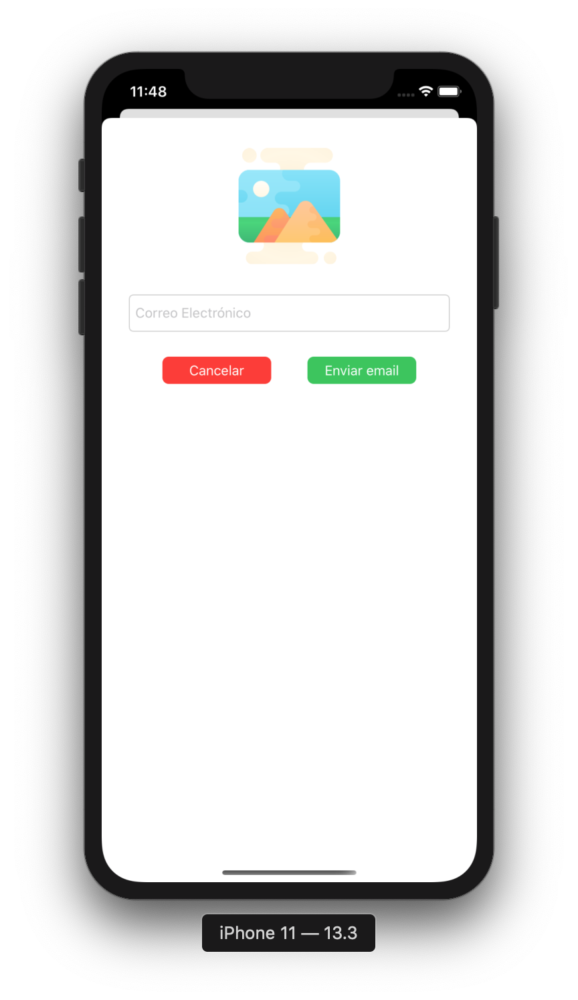

# Primer proyecto Diplomado iOS 5ta Gen

### Características

- Realizada con AutoLayout, vistas programadas (Sin StoryBoards, solo Anchors)
- Separación lo más que se pudo MVC
- Delegados para separar las tareas 
- Se puede ver el perfil del usuario registrado y editarlo
- Subir fotos y poder darles "like" a un repositorio de fotos común.
- Un coordinador para llevar las vistas (bugs)

  
  
  
  
  
  

